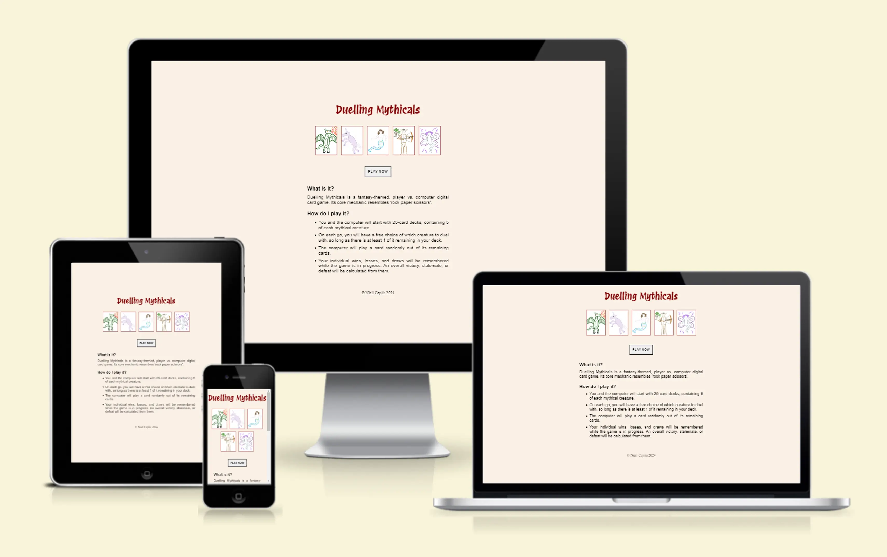
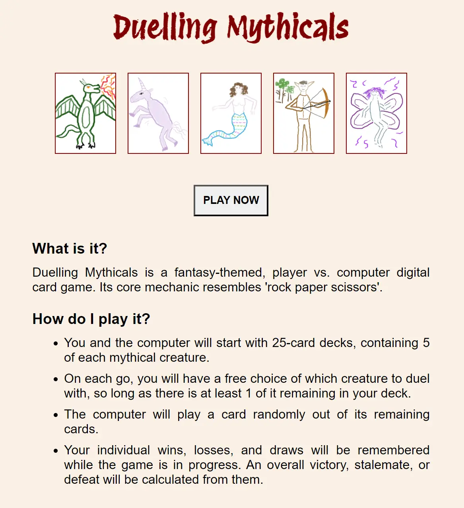
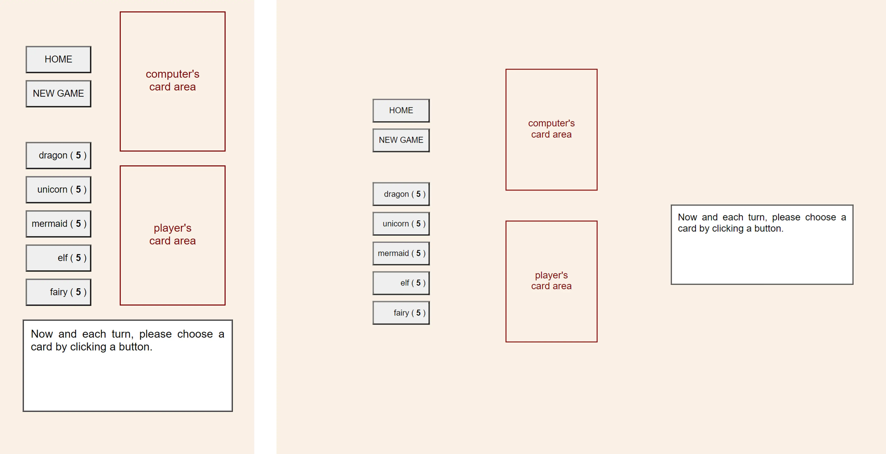
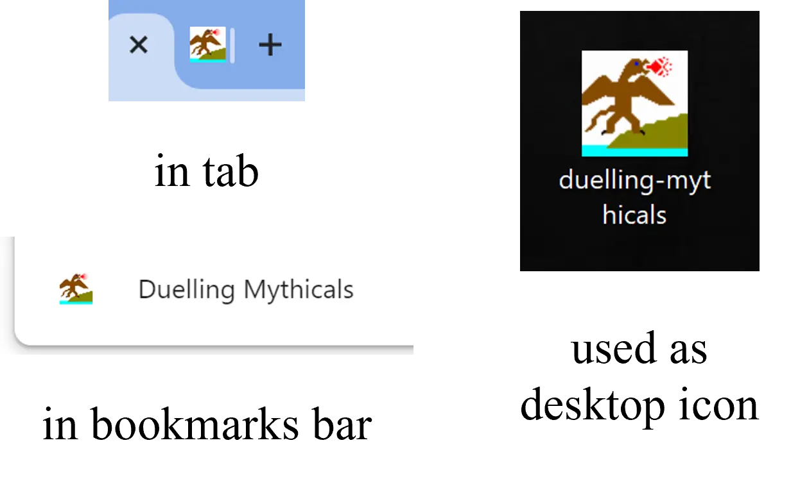
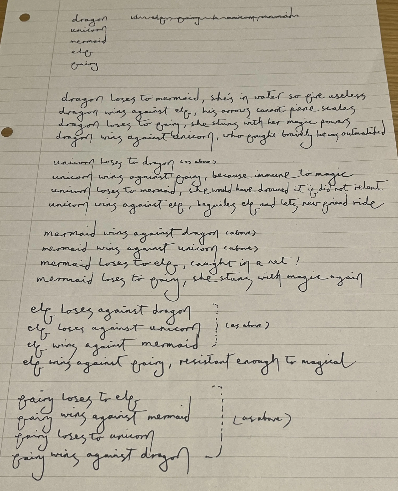
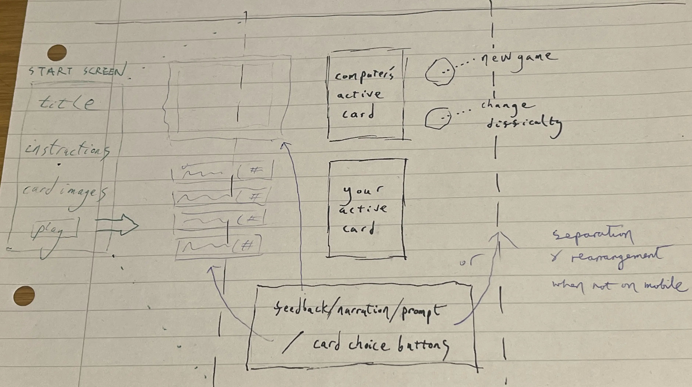
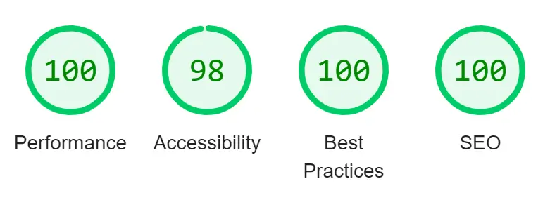

# Duelling Mythicals

'Duelling Mythicals' is a fantasy-themed web game inspired by "rock paper scissors". It has characteristics of a digital card game but is single-player, or player versus computer.

The target audience is people with some interest in speculative fiction and who want to play a quick, chance-based game rather than a lengthier, brain-challenging game - for example, as an amusement during a lunch break or in a waiting room.

The user's need is to be casually entertained, in a manner that involves them beyond passive watching yet without demanding much mental energy from them.

The site owner goals are the satisfaction of offering a way to meet that need and the opportunity for creative expression.

[The deployed project can be viewed here.](https://niall-code.github.io/duelling-mythicals/)

## Features

### Start Screen

- #### Heading

  The name of the game is displayed at the top of the start screen in Octavio Pardo's [Protest Revolution](https://fonts.google.com/specimen/Protest+Revolution) from Google Fonts, which I decided was subjectively well-suited to the feel of the game.

  I had originally planned it to be present also on the game screen, but chose for it to be replaced along with the rest of the start screen, largely on the grounds that it would otherwise unnecessarily claim a portion of already limited screen space on mobile devices - fitting the game screen into a mobile viewport with little or no scrolling being much preferential.

- #### Gallery

  The five cards around which the game revolves are displayed in miniature on the start screen, adding visual interest to it and potentially increasing curiosity to try the game.

- #### 'Play Now' Button

  The begin button, labelled clearly with the words 'play now', is the next element of the start screen.

  I had originally planned to place it after the instructions, but decided it was better for it to be prominently placed above them on the start screen. It can be immediately seen without any scrolling, and for user's who have already read the instructions once, the begin button will thereafter be higher in importance.

  The begin button has an event listener which calls the `initialise()` function. The effect is that the start screen's HTML is wiped away and the HTML for the game screen is inserted in its place. As such, 'Duelling Mythicals' is a one page application.

- #### Instructions

  The final elements of the start screen (besides a brief copyright note) are a summary of what the game is and some basic instructions/steps explaining the key points of what the game is like and how it works, making the nature of the game clear to new users and reducing obstacles to the user feeling comfortable to attempt a new-to-them game.

### Game Screen

- #### Card Areas

  This is where the chosen cards appear. Comparably to several well-known collectible card games, two selected cards are placed in physical alignment with each other and are imagined to face each other in one-on-one combat.

- #### Text Area

  A text box area displays prompts, narrations of various conflict outcomes, and scores.

- #### Card Selection Buttons

  On each go, clicking or tapping a button with a named species will cause the appropriate card to appear in the player's card area, and trigger the computer to likewise pick a card (using random number generation) and display it in its own card area, a comparison and a reported outcome in the text area following immediately.

  The card selection buttons also show the number of each species remaining in the player's deck. When a particular button reaches zero, it becomes disabled.

- #### Non-Gameplay Buttons

  The user can click 'new game' to play the game again, or 'home' to go back to the start screen. If a game is in progress, confirmation of the user's intention is sought first.

### Favicon

I used [X-Icon Editor](https://www.xiconeditor.com) to make a favicon resembling a dragon. It will help the user to easily locate Duelling Mythicals among a potential multitude of open tabs, bookmarks, or shortcuts. Also, subjectively, a site with a favicon can feel more complete or even more trustworthy.

Below, the favicon is seen in some of its possible locations. I temporarily changed a folder icon to my favicon to simulate what it might look like if occurring in a shortcut.

## Planning

### Initial ideas

I decided to make a 'rock paper scissors'-based, fantasy-themed digital card game (player vs. computer) called Duelling Mythicals.

I planned for the player and the computer to each have a deck with a fixed number of cards. The player would have a free choice of which card to play on each go, so long as there were enough of it remaining in the player's deck. The computer would play a card randomly out of the cards remaining in its deck. The player would be shown how many mythical creatures of each kind were remaining in their own deck, but could only know the composition of the computer's remaining deck if they memorised or tallied which cards the computer had already played.

I planned for the individual wins, losses, and draws to be tracked and an overall victory, defeat, or possibly stalemate to be calculated from them when the decks are empty. The counts of the individual outcomes would be revealed along with the final result, in case the player wished to know how close the game had been.

I planned that a brief narrative justification would be given for each win, loss, or draw, comparable to the reasonings that underpin the original game (e.g. "scissors cut paper"), as seen here:

### Wireframe

I sketched a wireframe of my initial ideas regarding layout, including some preliminary thoughts on responsiveness, together with a plan to have a start screen that is replaced with the game screen when the user clicks a begin button, as seen here:

## Testing & Deployment

### Development Stage Testing

Throughout development, I constantly checked that my project was behaving and appearing as intended using live previews, and generally made immediate changes if that was not the case.

To confirm that cards were being removed from the deck, I temporarily added a `console.log()` into my code to observe returned values of splices.

When enough of the game mechanics were in place, I expanded my preview system into playing the game myself to look for bugs and fix them. There are two noteworthy instances where this proved beneficial:

- I discovered that sometimes the computer's card failed to display, saying "undefined image" in its place. I worked out that this was likely due to my random number generator occasionally rounding upward to a number one above the highest existing index of the remaining cards. I made a change from `Math.round()` to `Math.floor()` and that eliminated the bug.

- I discovered that an empty deck array was not triggering the display of scores as I had first expected, and so I changed `endOfGame()`'s first condition from `!playerDeck.length` to `playerDeck.length === 0`, which removed the bug.

  - In the process, I also realised that the card selection buttons needed to be disabled when they reached zero, else they might be clicked again regardless and continue downward into negative numbers.

### Deployment

As is common practice, Git and GitHub were used for version control and remote repository, respectively.

To deploy to GitHub Pages, from my GitHub repository, I simply clicked Settings, then Pages, and selected 'main' as the branch and clicked Save.

The deployed project can be found here: https://niall-code.github.io/duelling-mythicals/

After this, I attempted to add a custom domain but I realised that I did not yet have some necessary knowledge to make it secure (that is, https rather than just http), so I immediately clicked Remove, for the sake of caution. The brief attempts were automatically reflected in my repository's commit history.

#### To Fork and Clone

Fromy my GitHub repository, the code can easily be forked by simply clicking the Fork button near the top right of the screen.

Alternatively, by clicking the Code button (also towards the top right), the address needed when cloning the repository can be revealed - which is simply the repository's URL address with " .git " appended. You would then follow a `git clone` terminal command with the address, from an appropriate directory to receive the clone. This is doing using Git, so that must be installed first if not already present.

### Post-Deployment Testing

#### Testing by Playing

Relatives played my deployed web game on an iOS tablet and an Android mobile.

One of them gave feedback indicating that the clarity of the text zone's start-of-game prompt needed to be slightly improved. It has been edited accordingly.

I noticed that the favicon was not appearing. I added the relevant line of code in the head of my HTML and now it is.

I observed that iOS restyled my buttons, making them too small - such that the closing bracket on the mermaid button was forced onto a new line and the chances of accidentally clicking a wrong button looked higher than I would have liked. Through general researching and experimentation, I came up with a simple CSS rule ( `appearance: none;` ) to insert that adequately solves the problem. On my computer, the buttons now look slightly different than before but still are okay. On iOS devices, the buttons now are altered enough from how they were that the bracket is not on a new line and the chances of pressing a button by accident are sufficiently reduced. Since my laptop is not iOS, the fix could not easily be tested prior to its inclusion. Consequently, a second attempt was required, as can be seen in the resulting commit history.

#### Testing with Validators

My deployed project was handed to HTML and CSS validators and a JavaScript linter.

- [W3C Markup Validation](https://validator.w3.org/nu/?doc=https%3A%2F%2Fniall-code.github.io%2Fduelling-mythicals%2F) showed no errors or warnings.

- [W3C CSS Validation](https://jigsaw.w3.org/css-validator/validator?uri=https%3A%2F%2Fniall-code.github.io%2Fduelling-mythicals%2Fassets%2Fcss%2Fstyle.css&profile=css3svg&usermedium=all&warning=1&vextwarning=&lang=en) found no errors.

- [JSHint](https://jshint.com/) reported 40 warnings for the contents of my script.js file.
  - On JSHint's advice, I added semicolons to lines 23, 31, 39, 47, and 55 of my code. This reduced it to 35 warnings.
  - Most of the remainder are simply that something "is available in ES6" or "is only available in ES6".
  - The only exceptions are 5 cases of "Expected an assignment or function call and instead saw an expression", in reference to my score-tallying ternary operators within my `compareCards()` function. I believe this is merely because I have written it such that three different variables might have their value reassigned depending on which conditions are met. This is a necessary aspect of the game's functionality and my testing has shown it to be working as I intended.

#### Lighthouse Testing

My deployed project also was inspected with Google's Lighthouse.

## Gitignore

My .gitignore file is empty at present, since there are no sensitive or automatically generated files appearing in the directory tree which would require instructions that they be ignored. Regardless, the .gitignore is included as a matter of good practice, so that files can be made ignored easily should the need arise.

## Credits

- The [Protest Revolution](https://fonts.google.com/specimen/Protest+Revolution) font used for the start screen heading is imported from Google Fonts and was designed by Octavio Pardo.

- I used [Tiny PNG](https://tinypng.com) to optimise images and convert them to .webp, both for the web game itself and for display in this README.

- I used [X-Icon Editor](https://www.xiconeditor.com) to make the favicon.

- The cards' representations of the creatures were drawn by myself using Clip Studio Paint software.

- The responsiveness mockup at the top of this README was created with [Am I Responsive](https://ui.dev/amiresponsive).