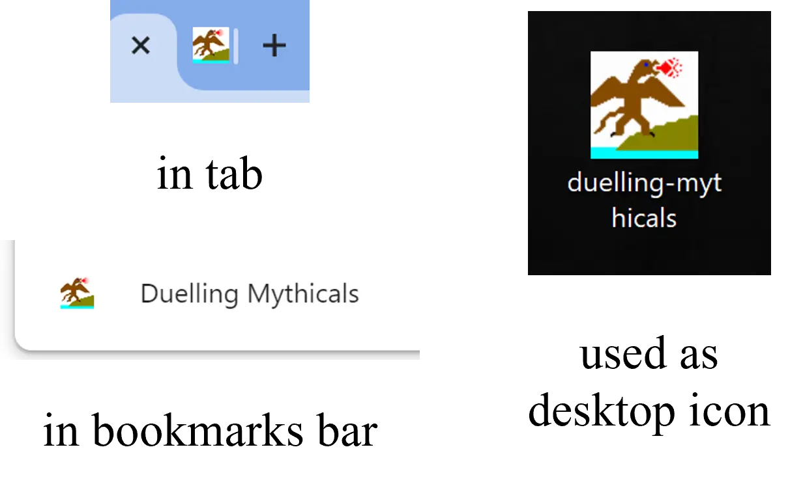
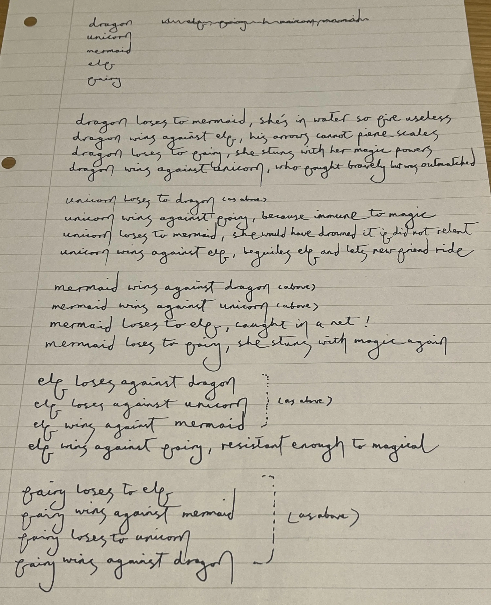
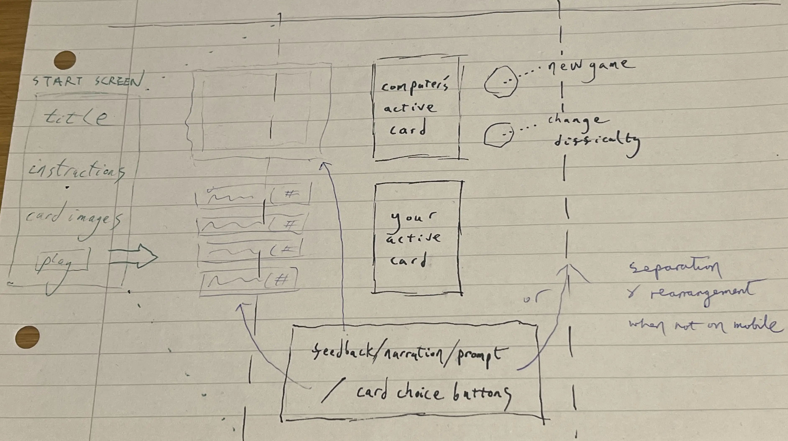

# Duelling Mythicals

## Features

### Favicon

I used [X-Icon Editor](https://www.xiconeditor.com) to make a favicon resembling a dragon. It will help the user to easily locate Duelling Mythicals among a potential multitude of open tabs, bookmarks, or shortcuts. Also, subjectively, a site with a favicon can feel more complete or even more trustworthy.

Below, the favicon is seen in some of its possible locations. I temporarily changed a folder icon to my favicon to simulate what it might look like if occurring in a shortcut.

## Planning

### Initial ideas

I decided to make a 'rock paper scissors'-based, fantasy-themed digital card game (player vs. computer) called Duelling Mythicals.

I planned for the game to have two difficulty levels for the user to choose between - a basic mode with three options for the player to select from on each go, and an advanced mode with five options for the player to select from.

I planned for the player and the computer to each have a deck with a fixed number of cards. The player would have a free choice of which card to play on each go, so long as there were enough of it remaining in the player's deck. The computer would play a card randomly out of the cards remaining in its deck. The player would be shown how many mythical creatures of each kind were remaining in their own deck, but could only know the composition of the computer's remaining deck if they memorised or tallied which cards the computer had already played.

I planned for the individual wins, losses, and draws to be tracked and an overall victory, defeat, or possibly stalemate to be calculated from them when the decks are empty. The counts of the individual outcomes would be revealed along with the final result, in case the player wished to know how close the game had been.

I planned that a brief narrative justification would be given for each win, loss, or draw, comparable to the reasonings that underpin the original game (e.g. "scissors cut paper"), as seen here:

### Wireframe

I sketched a wireframe of my initial ideas regarding layout, including some preliminary thoughts on responsiveness, together with a plan to have a start screen that is replaced with the game screen when the user clicks a begin button, as seen here:

## Credits

- I used [Tiny PNG](https://tinypng.com) to optimise images and convert them to .webp, both for the web game and for display in this README.

- I used [X-Icon Editor](https://www.xiconeditor.com) to make the favicon, as mentioned in the features section.